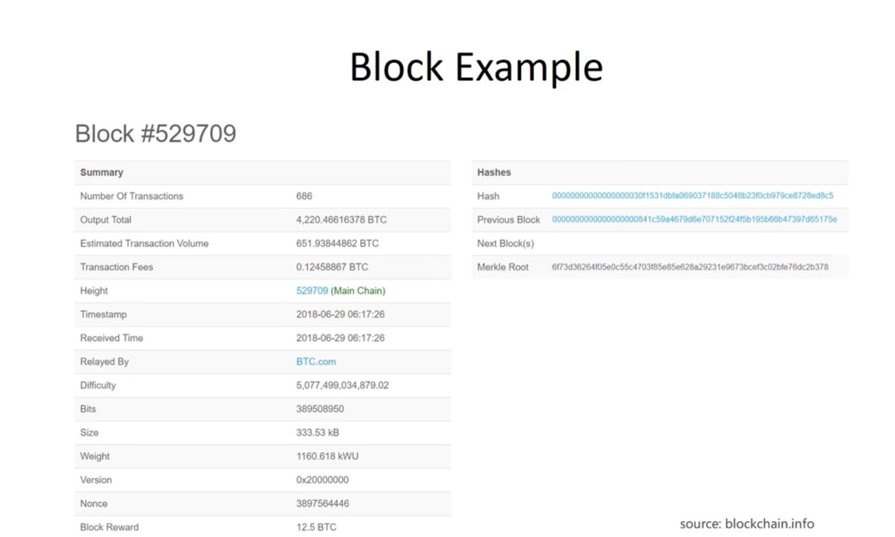
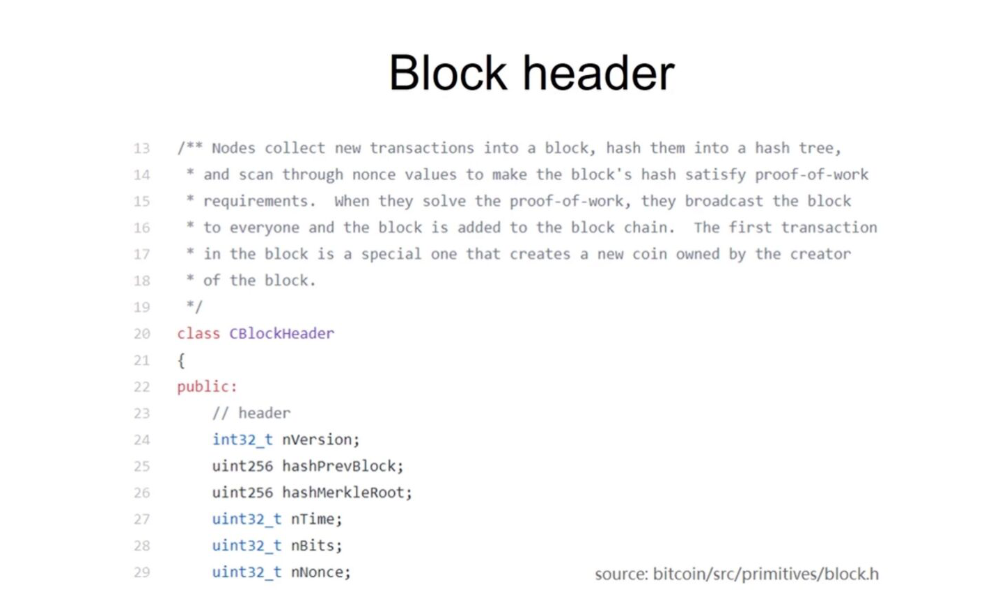
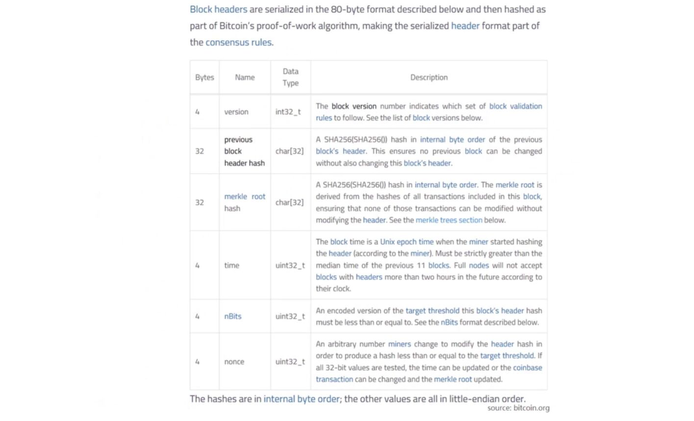
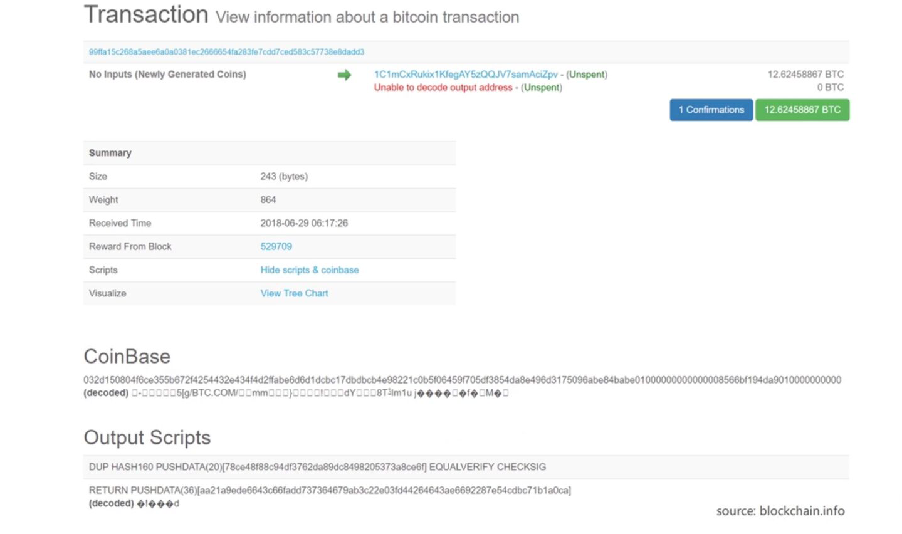
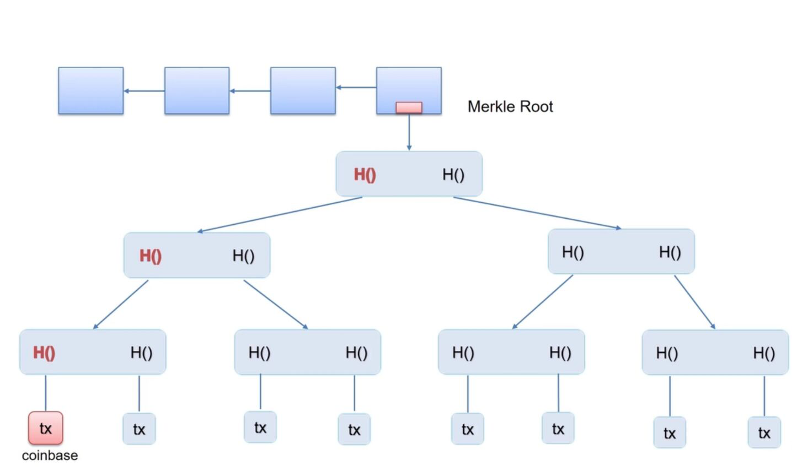
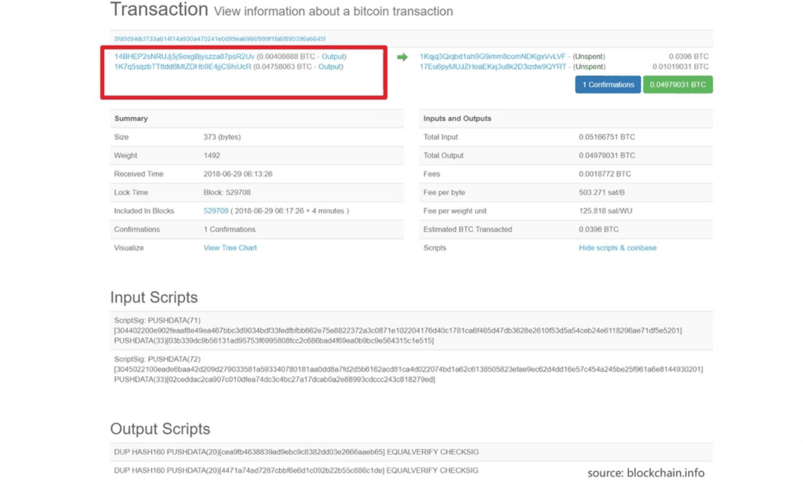
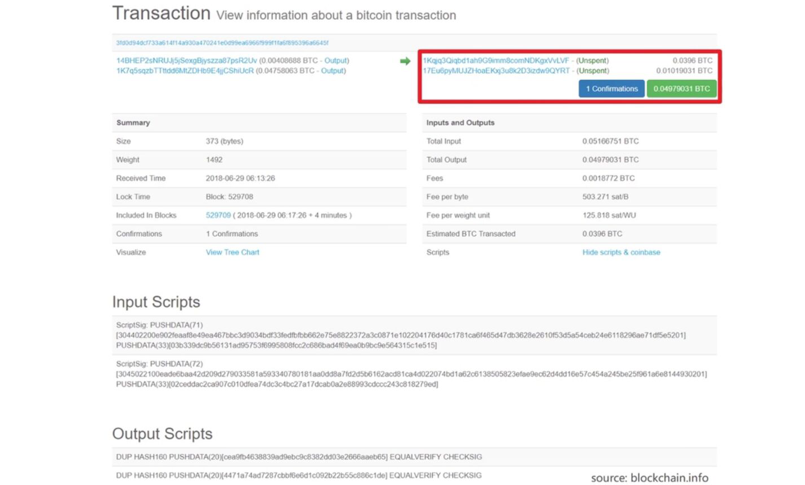
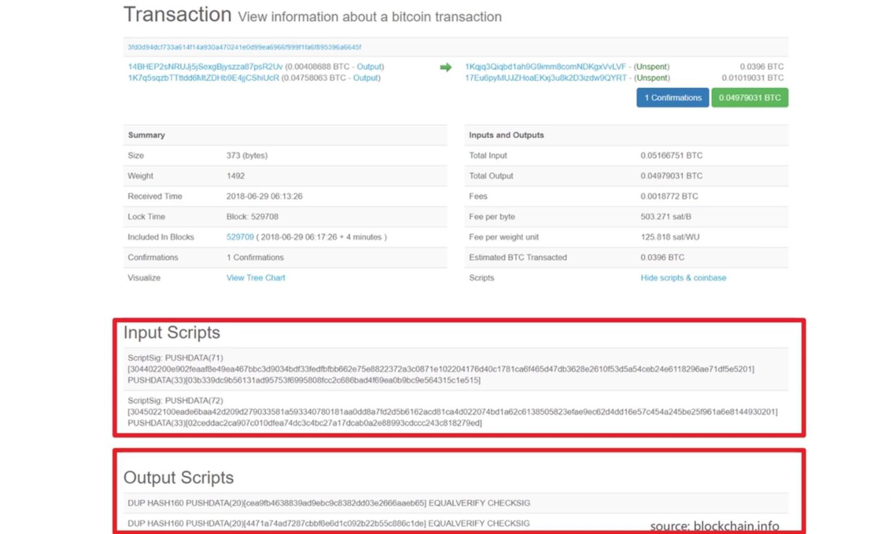

# BTC(crypto currency)
## -BTC-密码学原理 
### 哈希
- Cryptographic hash function-密码哈希函数 
  - collision resistance 
    x≠y,H(x)=H(y) (意指当H(x)=H(y)时,求解y时只能依靠蛮力即brute-force) 
    用途:对消息m求哈希H(m),当m被篡改后，H(m)随着改变，且无法找到(理想情况下)消息m'使得H(m')=H(m) 
  - Hiding 
    满足x->H(x),得不到H(x)->x,即不可逆性(前提时输入空间要足够大，遍历无法求解，且要求输入分布均匀) 
  - digital commitment/digital equivalent of a sealed envelope(数字承诺，提供无法被篡改的第三方凭证)
  - puzzle friendly(哈希值是不可预测的，无法确定范围) 
    **BTC挖矿原理 H(block header)<=target** 
    **其中block header有很多域，其中一个域可以设计nonce 
    遍历nonce，找到正确的nonce即可发布新的Block** 
- proof of work(工作量证明) 
- SHA-256(Secure Hash Aligorithm)  
  - 为BTC中常用的哈希函数 
### 数字签名
- 去中心化 
   去中心化开账户后会得到*<*public key,private key>*(公私钥对，且公钥公开)--公钥相当于账户名，私钥相当于账户密码
- asymmetric encryption algorithm--非对称加密体制
  公钥加密，私钥解密
- 数字签名机制
  进行BTC转账时，转账人用私钥对交易进行**签名**，交易信息发布在Block Chain上，其他人用公钥对消息进行**验证**----RSA,ESA,ECDSA(经典数字签名算法) 
## -BTC-数据结构
- Hash pointersI(保证无环)   
  区别于普通指针---哈希指针可以存储哈希值(可以验证所指向的结构体有没有被篡改 
### 区块链  
- *Block Chain is a linked list using hash pointers.*  
   
  下一个区块的哈希值的产生必须是对本区块所有的内容取哈希(包括指向前一区块的哈希指针)
- tamper-evident log---篡改证明记录
    若对区块链中任一区块进行修改，则该区块以后的区块哈希值全部改变（包含最后一块），即记录下最后一块的哈希值，可以监测区块是否被篡改。 
### Merkle tree

- 区块的组成
  - block header(存储Merkle tree根哈希值，并无具体交易列表信息)
  - block body(存储交易列表) 
- BTC节点分类  
  - 全节点(保存整个区块的信息)
  - 轻节点(只保存block header)
- Merkle Proof  
  轻节点向Merkle tree寻求验证，交易是否被写进区块链中，即在Data Blocks中找到该交易信息，不断向根节点取哈希，验证root hash是否正确  
   
  轻节点向全节点发起申请，全节点提供所需哈希(红色部分)，不断进行验证得出Merkle Root。
- Proof of membership(证明Merkle Tree中包含某个交易信息) 
  时间复杂度 O(log(n))
## -BTC-协议
- double spending attack--双重支付攻击 
    类比实际生活中发行数字货币，防止双重攻击可以在央行系统(非去中心化中的管理员)登记币与币所有者(对应)。在比特币系统中，利用区块链数据结构，将由所有用户共同扮演管理员的身份。 
     
    比特币系统中每个交易都包含输入输出两部分，输入部分说明币的来源，输出部分说明收款人公钥的哈希。 
    此时区块链中有两种哈希指针 
    - 一种是连接各个区块之间的哈希指针(见上文)
    - 一种是指向前面某个交易的，是为了说明币的 来源。 
- 比特币系统不支持查询个体账户的公钥(地址)的 功能。 
  在发生交易时，举例A->B(5)，A要得到B的公钥(转账地址)的同时，B和全体用户也必须知道A的公钥(用A的公钥去验证消息，确认交易合法性)。A的公钥由A自己向全链进行广播。A在这里进行广播的公钥必须和币的来源(即接收币的时候所持有的公钥地址)相一致。(防止有恶意用户假装A进行转账)。
- 区块的组成 
    上文提到每一个区块由两部分组成，即Block header,Block body
  - Block header 内含信息：reversion(区块链版本信息)，hash of previous block header(哈希指针),Merkle root hash(Merkle tree的根哈希值),target(人为设计的目标阈值),nonce(随机数)。
  - Block body 内含信息：trasacation list(交易列表)
- 节点的分类 
  - full node(fully validating node)(保存区块链的所有信息)
  - light node(只保存block header信息)
- distributed consensus(分布式共识)
  - CAP Theorm
    - Consistency
    - Availability
    - Partition tolerance 
 表示在任意分布式系统中这三个性质中最多智能满足两个。
- Consensus in BitCoin
  - 所有节点在发布新区块前都会在本地预装出区块，把合法交易(节点主观上)放置进区块链中，直到成功找到nonce值的节点可以发布区块--获得记账权(包含预装的区块中交易信息)，然后所有节点验证区块信息(block header,block body)，如若无误，选择接受这个区块。
  - longest valid chain 
    比特币系统中的节点接受的应是最长合法链
  - froking attack(分叉攻击)
  - special situation 
     
    当两个节点在几乎相同的时间发布出两个区块，则这种状况将会维持到最长合法链的诞生，即有一条链更早发布下一个区块，较短的那条链被舍弃(orphan block)。
  - block reward(出块奖励)  
    coinbase transaction(铸币交易)--币的来源
## -BTC-实现
### transaction-based ledger
- UTXO (*unspent transaction output*)--未使用交易的输出 
  比特币的交易由交易输入和交易输出组成，每一笔交易都要花费一笔输入，产生一笔输出，而其所产生的输出就是**未花费过的交易输出**即UTXO。
  > 现实世界中没有比特币，只有UTXO。 

  注： 
  - 比特币钱包中的账户余额，实际上是钱包通过扫描区块链并聚合所有属于该用户的UTXO计算得来的。 
  - 除了 coinbase交易之外，所有的资金来源都必须来自前面某一个或者几个交易的 UTXO
  - 任何一笔交易的交易输入总量必须等于交易输出总量，等式两边必须配平。(total inputs=total outputs+transaction fee)
- transaction fee
  当交易写进区块链中时，将会抽取transaction fee给发布区块的节点。
- Example
  - Block example(source:blockchain.info) 
  
  其中： 
    - Number of Transaction 区块中包含的交易信息
    - Output Total 总输出比特币
    - Transaction Fees 区块中所有的交易费
    - Height 区块的序号
    - Timestamp 时间戳
    - Difficulty 挖矿难度(保证出块时间在十分钟左右)
    - Nonce 随机值
    - block reward 出块奖励
    - Hash 该区块的块头哈希值
    - Previous Block 前一个区块的块头哈希值
    - Merkle Root Merkle tree的根哈希值 

    

    其中： 
    - unit32_t nNonce 表示nonce是32位的整数 
  注：32位nonce已经不能满足难度需求，需要再对block header中的某个域进行调整。

    

    其中： 
    - version 当前使用比特币版本号
    - previous block header hash 前一个区块的哈希
    - merkel root hash merkel tree的根哈希值
    - time 这个区块产生的时间
    - nBits 目标阈值编码后版本
    - nonce 随机值 
  观察block header中的各个域，想要对除nonce值以外的值进行修改，符合要求的只有merkle root hash.

    
  Coinbase Transaction作为铸币交易，无输入，内含coinbase域，可以通过更改coinbase域写入的值来控制difficulty。
  
  实际挖矿是两层循环遍历，第一层先找到extra nonce(coinbase域),第二层遍历找到nonce值才能发布新区块。 
  - transaction example 
  
  框内表示这个交易的输入，图中output实际指花掉的是之前哪个交易的output。
  
  框内表示UTXO
  
  交易的输入和输出都是由脚本来完成的，验证交易的合法性就是将上一笔交易的输出和这笔交易的输入配对进行验证。
### 挖矿概率
- Bernoulli trial: a random experiment with binary outcom
  - 每一次尝试nonce为伯努利试验，且两种结果的概率相差较大。
- Bernoulli process: a sequence of indepent Bernoulli trails
  - 性质：无记忆性--memoryless
- exponential distribution
  - 出块时间满足指数分布(整个系统的出块时间，且满足平均出块时间维持在10分钟)
  - 矿工的出块时间取决于矿工的算力在总算力中的占比
- geometric series 
  比特币系统中，每挖出21万个区块，出块奖励减半(初始出块奖励为50个比特币)，比特币系统中比特币总量为: 
  $210000\times50+210000\times25+210000\times12.5+\ldots$ 
  $=210000\times50\times(1+\frac{1}{2}+\frac{1}{4}+\ldots)$ 
  $=21000000$ 
  即，比特币总量为2100万 
- Confirmation机制--等到该区块后的六区块发布出来后，该区块得到彻底确认。
## -BTC-网络
- The BitCoin Network
  application layer:BitCoin Block Chain 
  ***
  network layer:P2P Overlay Network
- principle: simple,robust,but no efficient
### -BTC-挖矿难度
## H(block header)<=target
- $difficulty=\frac{diffulty\_1\_target}{target}$ 
  - *difficulty_1_target*:挖矿难度为1(难度值最小)时候对应着的target
  - 如果不调整挖矿难度，出块时间会越来越短，系统中会出现越来越多的**分叉**，从而危害系统的共识性和安全(随着分叉条数越来越多，系统中总算力被分散，容易被恶意节点执行恶意操作)
- 比特币系统中每隔2016个区块要调整一次挖矿难度。 
  $\frac{2016\times10(min)}{60\times24}$=14(day)
  - 10(min)：比特币系统中平均出块时间为10min
  - 2016：每隔2016个区块要调整一次挖矿难度 
  即每隔14天调整一次挖矿难度 
  - $target=target\times\frac{actual time}{expected time}$
    - actual time:time spent mining the last 2016 blocks
    - expected time:$10\times2016$(平均出块时间乘区块个数)
  

  

    