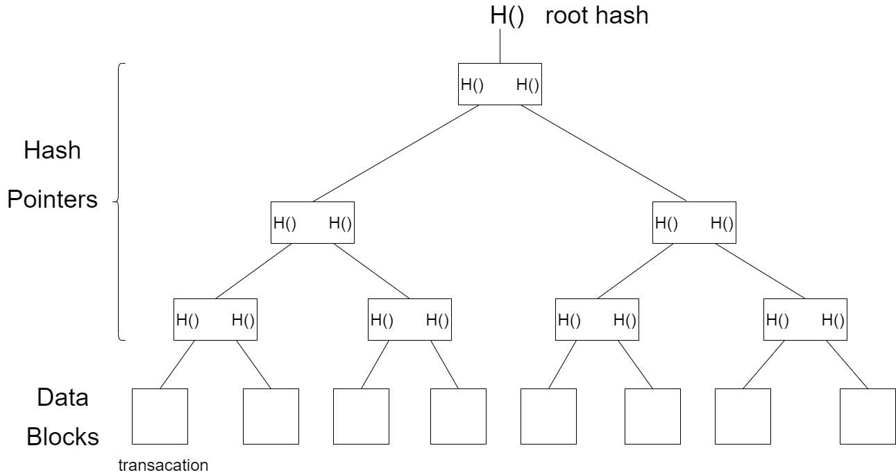

# BTC(crypto currency)
## -BTC-密码学原理 
### 哈希
- Cryptographic hash function-密码哈希函数 
  - collision resistance 
    x≠y,H(x)=H(y) (意指当H(x)=H(y)时,求解y时只能依靠蛮力即brute-force) 
    用途:对消息m求哈希H(m),当m被篡改后，H(m)随着改变，且无法找到(理想情况下)消息m'使得H(m')=H(m) 
  - Hiding 
    满足x->H(x),得不到H(x)->x,即不可逆性(前提时输入空间要足够大，遍历无法求解，且要求输入分布均匀) 
  - digital commitment/digital equivalent of a sealed envelope(数字承诺，提供无法被篡改的第三方凭证)
  - puzzle friendly(哈希值是不可预测的，无法确定范围) 
    **BTC挖矿原理 H(block header)<=target** 
    **其中block header有很多域，其中一个域可以设计nonce 
    遍历nonce，找到正确的nonce即可发布新的Block** 
- proof of work(工作量证明) 
- SHA-256(Secure Hash Aligorithm)  
  - 为BTC中常用的哈希函数 
### 数字签名
- 去中心化 
   去中心化开账户后会得到*<*public key,private key>*(公私钥对，且公钥公开)--公钥相当于账户名，私钥相当于账户密码
- asymmetric encryption algorithm--非对称加密体制
  公钥加密，私钥解密
- 数字签名机制
  进行BTC转账时，转账人用私钥对交易进行**签名**，交易信息发布在Block Chain上，其他人用公钥对消息进行**验证**----RSA,ESA,ECDSA(经典数字签名算法) 
## -BTC-数据结构
- Hash pointersI(保证无环)   
  区别于普通指针---哈希指针可以存储哈希值(可以验证所指向的结构体有没有被篡改 
### 区块链  
- *Block Chain is a linked list using hash pointers.*  
   
  下一个区块的哈希值的产生必须是对本区块所有的内容取哈希(包括指向前一区块的哈希指针)
- tamper-evident log---篡改证明记录
    若对区块链中任一区块进行修改，则该区块以后的区块哈希值全部改变（包含最后一块），即记录下最后一块的哈希值，可以监测区块是否被篡改。 
### Merkle tree

- 区块的组成
  - block header(存储Merkle tree根哈希值，并无具体交易列表信息)
  - block body(存储交易列表) 
- BTC节点分类  
  - 全节点(保存整个区块的信息)
  - 轻节点(只保存block header)
- Merkle Proof  
  轻节点向Merkle tree寻求验证，交易是否被写进区块链中，即在Data Blocks中找到该交易信息，不断向根节点取哈希，验证root hash是否正确  
   
  轻节点向全节点发起申请，全节点提供所需哈希(红色部分)，不断进行验证得出Merkle Root。
- Proof of membership(证明Merkle Tree中包含某个交易信息) 
  时间复杂度 O(log(n))
  
  
   

  

    